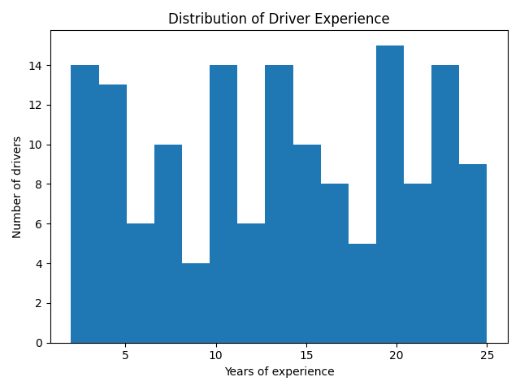
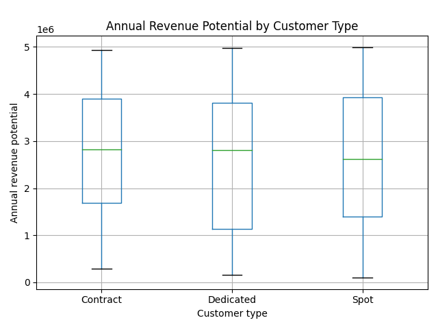

# Logistics & Customer Analytics (Python Data Analysis Project)


---

## Project Overview

This project performs exploratory data analysis (EDA) on a transportation and logistics company dataset using Python.

The dataset includes:

* customers
* drivers
* contracts
* revenue potential
* hiring and employment status

The goal of the project is to understand operational patterns, workforce structure, and customer revenue distribution through statistical analysis and data visualization.

This project demonstrates practical data analysis skills used in real business environments.

---

## Technologies Used

* Python 3
* Pandas
* Matplotlib
* NumPy
* CSV data processing

---

## Dataset Description

The analysis is based on two datasets:

**customers.csv**

* customer type
* credit terms
* annual revenue potential
* primary freight type
* contract start date
* account status

**drivers.csv**

* hire date
* termination date
* employment status
* driver experience
* driver age
* home terminal

The script also calculates derived fields such as:

* driver age
* driver tenure (years in company)

---

## Key Analyses Performed

### 1. Workforce Analysis

* Active vs terminated drivers
* Driver hiring trends per year
* Driver age distribution
* Driver experience distribution

### 2. Customer Analysis

* Customer distribution by freight type
* Revenue potential distribution
* Revenue by customer type
* Contracts started per year

### 3. Business Insights

* Revenue potential variability
* Credit term behavior
* Workforce stability
* Hiring trends

### 4. Advanced Analysis

* Correlation heatmap between numeric variables:

  * age
  * experience
  * tenure
  * revenue potential
  * credit terms

---

## Example Visualizations

### Driver Employment Status


### Driver Hiring Trend


### Driver Experience Distribution



### Driver Age Distribution


### Customers by Freight Type


### Revenue Distribution


### Revenue by Customer Type (Boxplot)



### Correlation Heatmap


### Contracts Started per Year


---

## How the Program Works

The script loads both datasets, cleans and transforms the data, calculates derived variables, and provides a menu that allows the user to generate different analyses and plots.

Charts are automatically saved to the Desktop.

---

## Installation

Clone repository:

```
git clone https://github.com/YOUR_USERNAME/YOUR_REPOSITORY_NAME.git
cd YOUR_REPOSITORY_NAME
```

Install dependencies:

```
pip install pandas matplotlib numpy
```

---

## How to Run

Place in the same folder:

* customers.csv
* drivers.csv
* customers.py

Run:

```
python customers.py
```

Then choose an option from the menu (0–10) to generate specific analysis.

---

## Skills Demonstrated

* Data cleaning
* Exploratory Data Analysis (EDA)
* Data visualization
* Statistical interpretation
* Business data interpretation
* Working with real-like datasets
* Python scripting for analytics

---

## What I Learned

Through this project I learned how to:

* analyze operational company data
* identify hiring and workforce patterns
* analyze revenue structure
* create meaningful visualizations
* interpret correlations between variables

---

## Author

**Agata Gabara**
IT Graduate | Data Analyst | Aspiring Bioinformatician

GitHub: [https://github.com/ag48665](https://github.com/ag48665)
