# WEKA Machine Learning Project — Product Rating Prediction

This project applies **data mining and machine learning techniques** in WEKA to analyse a nutritional dataset and predict product rating categories.

The goal was to move from raw data → patterns → predictive model.

---

## Final Results (Quick Summary)

* Feature selection identified **calories** as the most predictive attribute
* K-Means clustering discovered hidden groups in the dataset
* Logistic Regression and J48 achieved **100% training accuracy**
* Cross-validation accuracy: **~91%**
* Naive Bayes accuracy: **~92%**

The workflow followed a real analytics pipeline: exploration → modelling → evaluation.

---

## Dataset

The dataset contains nutritional information about food products, including:

* calories
* protein
* fat
* sodium
* carbohydrates
* sugars
* vitamins
* rating

The target variable was converted into categories:
**low / medium / high rating** 

---

## Tools Used

* WEKA data mining software
* Statistical analysis
* Clustering algorithms
* Classification algorithms
* Cross-validation testing

---

## Exploratory Data Analysis

### Distribution Analysis

Calories showed a normal distribution:

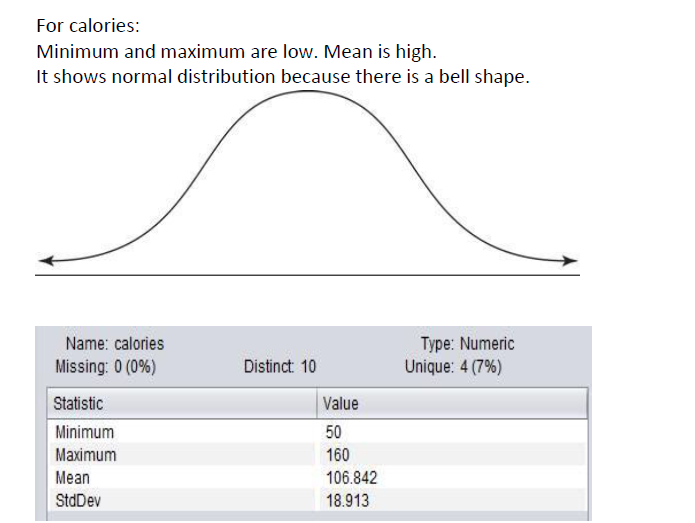

Protein showed a right-skewed distribution:

Carbohydrates showed a left-skewed distribution:

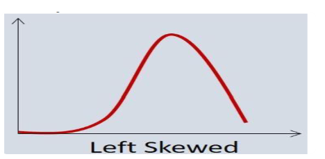

### Class Balance

Understanding rating categories before modelling:

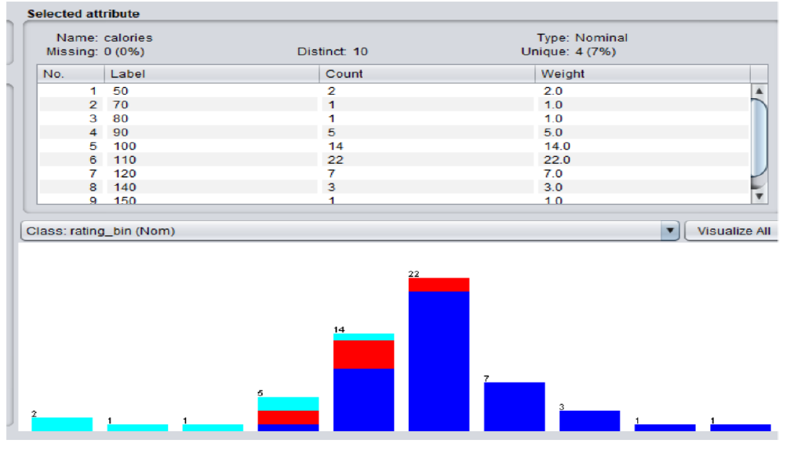

### Feature Relationship Example

Weak positive relationship between fibre and potassium:

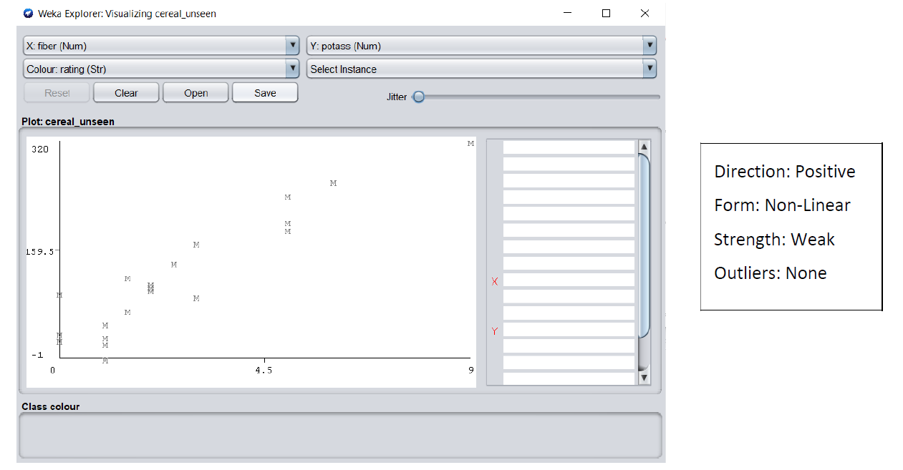

---

## Feature Selection

Using **CFS Subset Evaluator + Best First search**, the most useful predictive feature was identified as:

**calories**

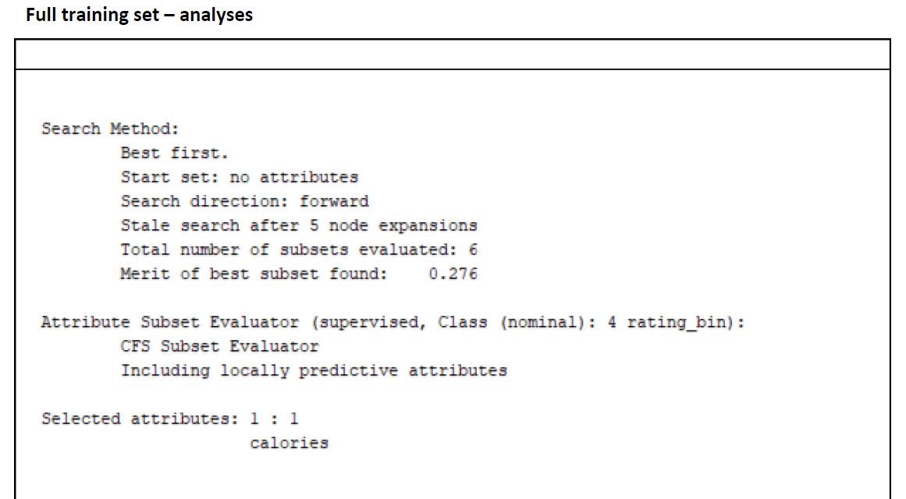

---

## Unsupervised Learning — Clustering

K-Means clustering grouped the data into two natural clusters (57 instances).

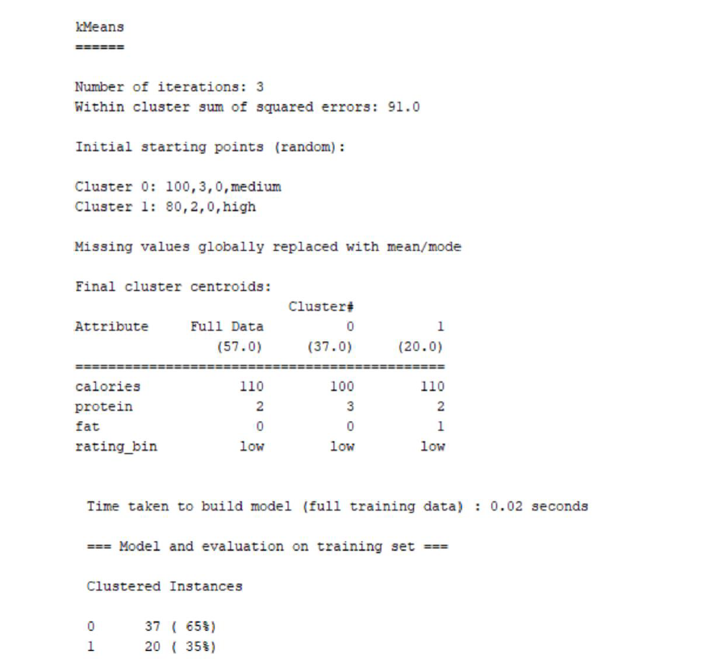

### Cluster Visualization

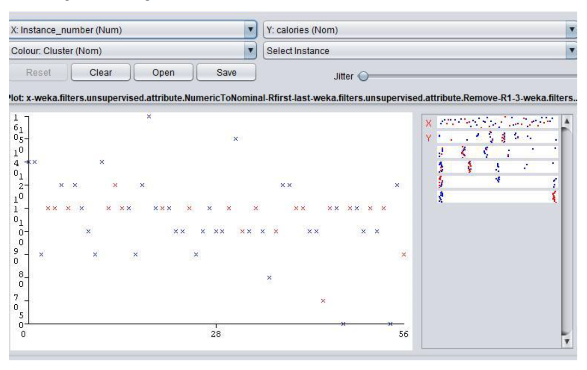

### Cluster Centroids Interpretation

Cluster centroids represent average attribute values for each group and help describe the discovered patterns.

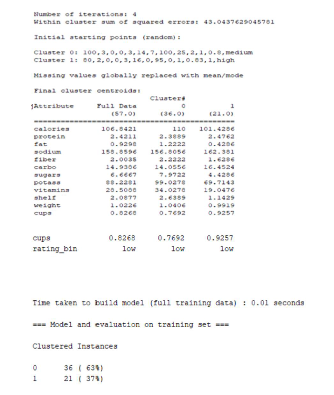

---

## Supervised Learning — Classification Models

Several predictive models were trained:

* Logistic Regression
* J48 Decision Tree
* Simple Logistic
* Naive Bayes

### Logistic Regression

### Confusion Matrix

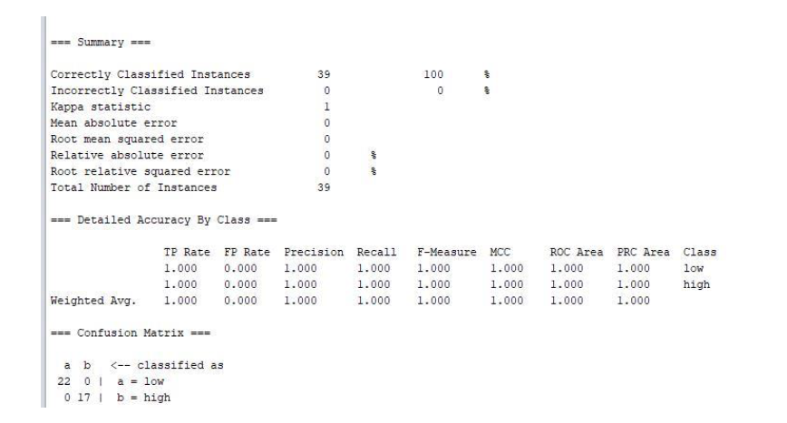

### Model Comparison

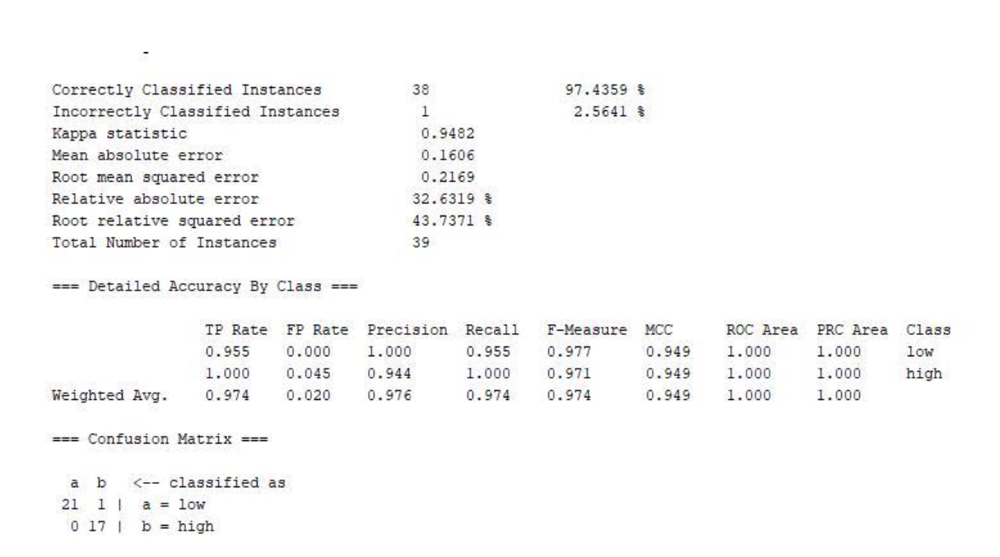

### Cross-Validation (Unseen Data)

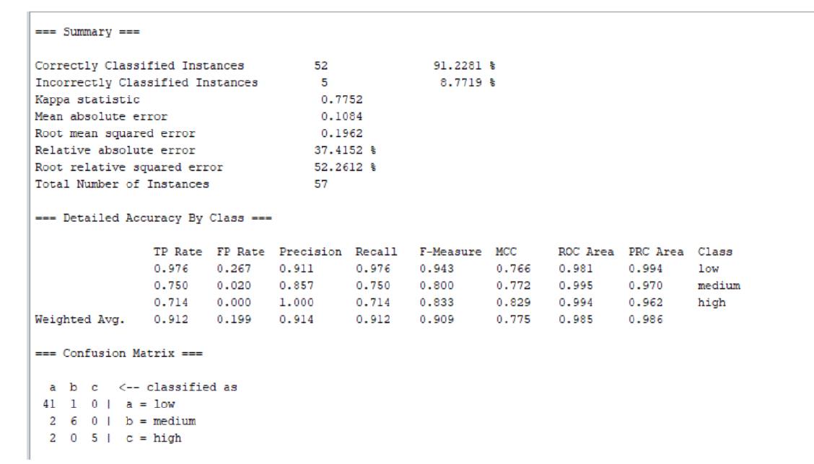

---

## Model Evaluation

Models were evaluated using:

* accuracy
* precision
* recall
* F-measure
* confusion matrix
* 3-fold cross validation

Cross-validation splits the dataset into multiple parts so every data point is tested at least once .

---

## Skills Demonstrated

* Exploratory Data Analysis (EDA)
* Feature selection
* Clustering analysis
* Classification modelling
* Model comparison
* Performance evaluation
* Machine learning workflow

---

## Conclusion

This project demonstrates how structured data can be analysed and transformed into a predictive system.
Both unsupervised and supervised learning approaches were implemented and evaluated, showing that meaningful patterns can be extracted and used to predict rating categories.

---

## Author

**Agata Gabara**
