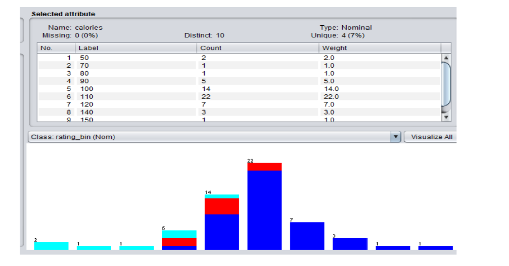

# Data Mining & Machine Learning Analysis (WEKA)

This project presents an end-to-end data mining and machine learning workflow using the **WEKA** data mining toolkit.
The objective was to explore a dataset, discover hidden patterns, and build predictive models capable of classifying product ratings.

The project was completed as part of a *Data Management and Business Intelligence* module.

---

## Project Objectives

The analysis followed the full **Knowledge Discovery in Databases (KDD)** process:

1. Understand and explore the dataset
2. Visualize patterns and relationships
3. Discover hidden patterns using unsupervised learning
4. Build classification models using supervised learning
5. Evaluate models using cross-validation
6. Predict unseen data

---

## Dataset Description

The dataset contains nutritional attributes of food products (cereal dataset).

Attributes include:

* Calories
* Protein
* Fat
* Sodium
* Carbohydrates
* Sugars
* Fibre
* Vitamins
* Cups
* Rating (target variable)

The numeric rating was transformed into a categorical variable **`rating_bin`** (Low / Medium / High) to enable classification.

---

## Exploratory Data Analysis

### Attribute Distribution

The histogram above shows the distribution of the *calories* attribute. Most cereal products are concentrated around 100–110 calories.
This step helps understand dataset structure before applying machine learning algorithms.

---

## Unsupervised Learning

### Association Rules (Apriori)

* Minimum support: 0.1
* Minimum confidence: 0.9
* 8 association rules discovered

### Clustering (K-Means)

* 57 observations
* 2 clusters generated

The clustering results showed weak separation between instances, meaning clustering was not suitable for reliable prediction on this dataset.

---

## Feature Selection

Using **CFS Subset Evaluator** with **Best First Search**, the most predictive attribute identified was:

**Calories**

---

## Supervised Learning

### Binary Classification

The classifier achieved very high performance when predicting two classes (Low vs High rating).

---

### Detailed Evaluation

The confusion matrix confirms that nearly all instances were correctly classified.

---

### Realistic Model Performance

The model correctly classified 38 out of 39 instances (97.43% accuracy).
One instance from the *Low* class was misclassified as *High*.

---

### Multi-Class Classification

For three classes (Low, Medium, High), performance decreased to **91.23% accuracy**, showing that predicting more categories is more difficult.

---

## Model Comparison

| Model               | Accuracy |
| ------------------- | -------- |
| Logistic Regression | 100%     |
| Decision Tree (J48) | 100%     |
| Simple Logistic     | 97.44%   |
| Naive Bayes         | ~92%     |
| 1R                  | ~90%     |

The **Decision Tree (J48)** and **Logistic Regression** models produced the best performance.

---

## Model Evaluation

3-fold cross-validation was used:

* Dataset divided into 3 parts
* Each part used once as a test set
* Remaining parts used for training

This method reduces overfitting and provides a more realistic estimate of model performance.

---

## Tools & Technologies

* WEKA
* Apriori Algorithm
* K-Means Clustering
* Logistic Regression
* Decision Trees (J48)
* Naive Bayes

---

## Learning Outcomes

* Data preprocessing
* Exploratory data analysis (EDA)
* Unsupervised learning
* Supervised machine learning
* Model evaluation and interpretation

---

## Disclaimer

This project is an academic exercise and not intended for real-world decision-making.
