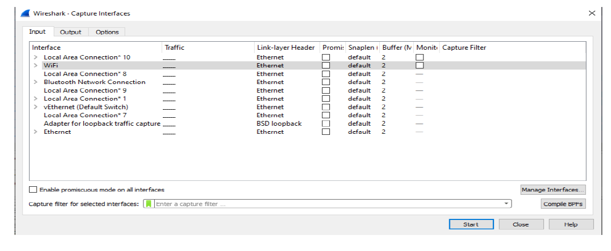
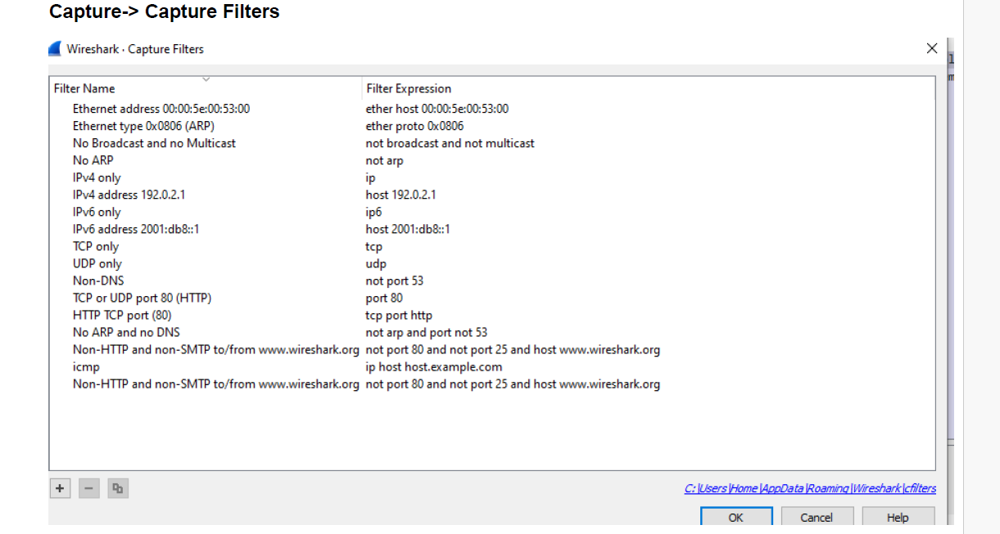
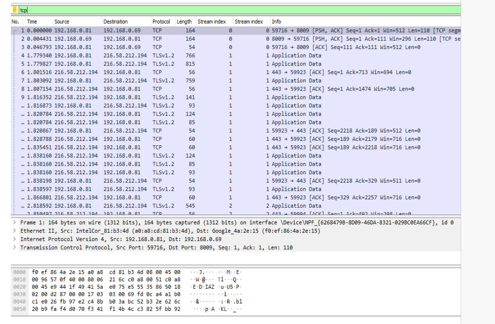
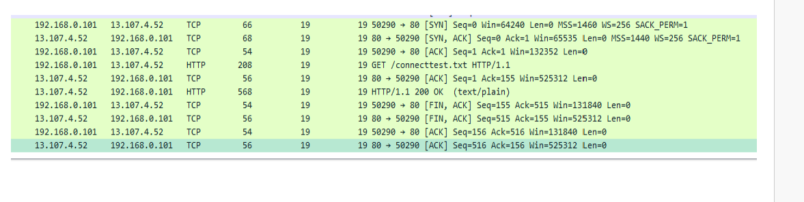
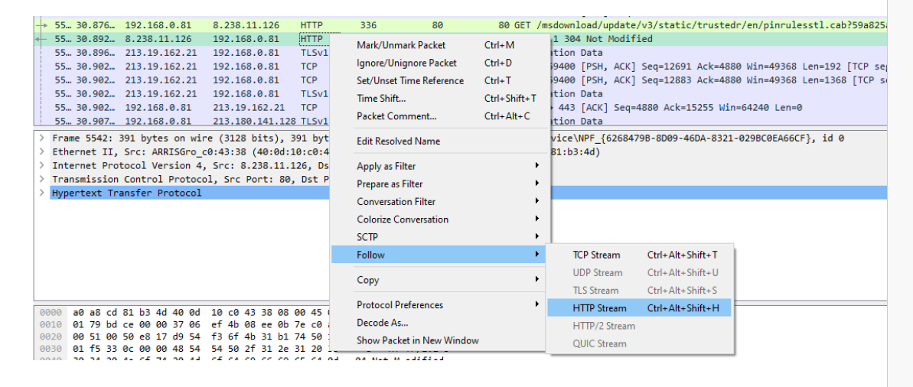
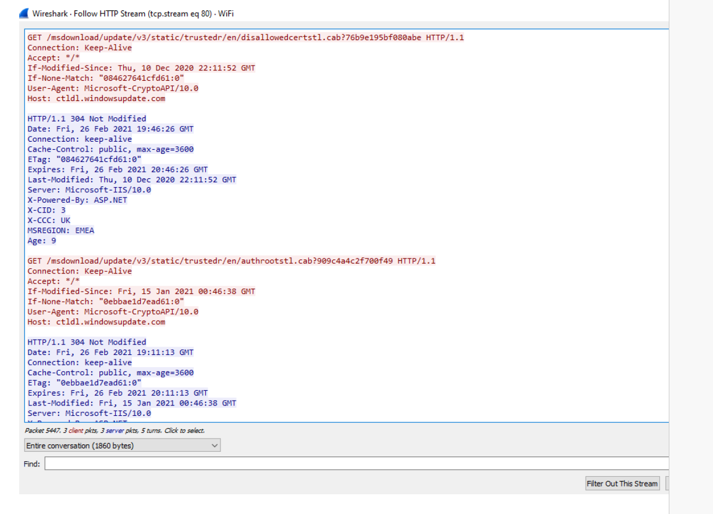
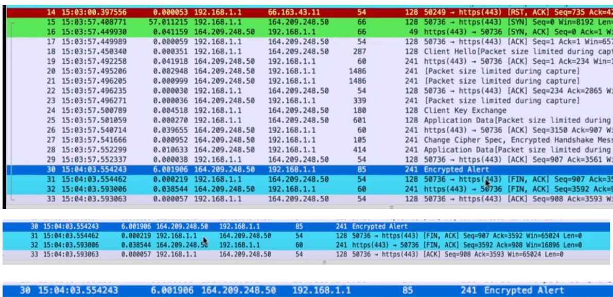
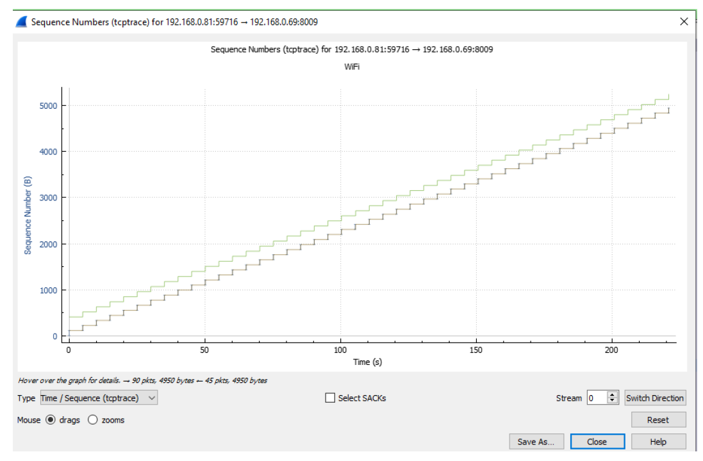
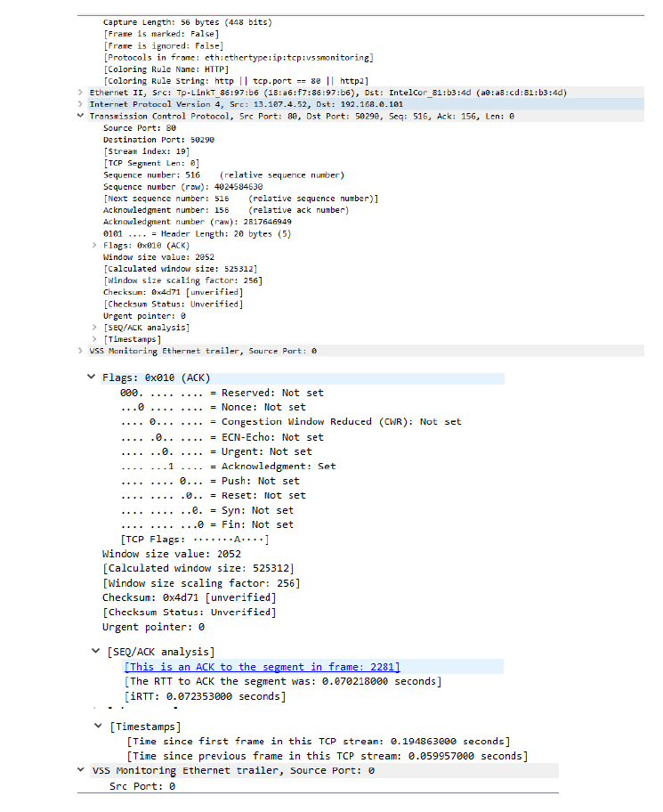
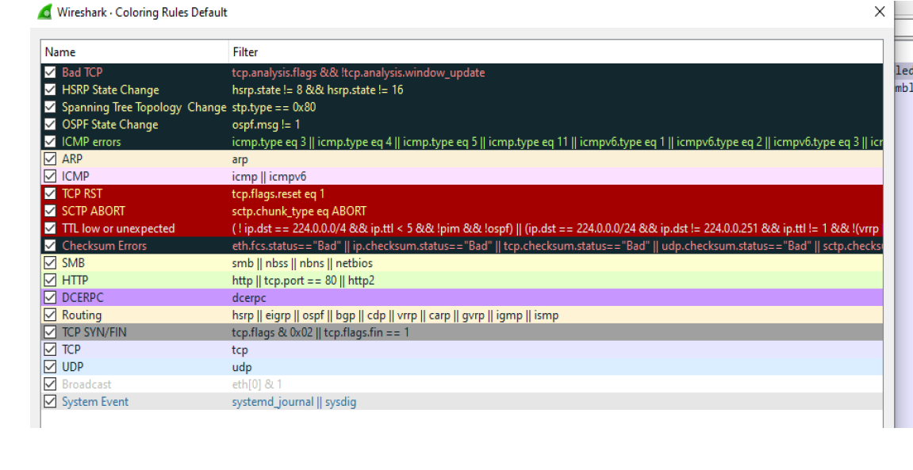

# Wireshark Network Traffic Analysis Lab

## Overview

This project documents a practical network analysis laboratory using **Wireshark**, an open-source packet analyzer developed by Gerald Combs. The aim of the lab was to capture, inspect, and interpret real network traffic in order to understand how network communication works at protocol level.

Wireshark captures live packets from a network interface and converts raw binary data into a human-readable format. Packet analysis (also called *packet sniffing* or *protocol analysis*) helps to:

* Understand network behavior
* Identify hosts communicating on the network
* Analyze bandwidth usage
* Detect suspicious or malicious activity
* Troubleshoot connectivity problems 

---

## Objectives

The goals of this lab were:

* Install and configure Wireshark
* Capture packets from a Wi-Fi network
* Analyze network protocols
* Understand the OSI model in real traffic
* Follow TCP and HTTP streams
* Use display and capture filters
* Identify hosts using IP and MAC addresses
* Investigate network connections using system tools

---

## Technologies & Tools

* Wireshark (packet capture and analysis)
* Windows Command Prompt / PowerShell
* Networking utilities:

  * `ipconfig`
  * `arp`
  * `netstat`
  * `ping`
  * `tracert`
  * `nslookup`

---

## How Wireshark Works

Wireshark performs three main operations:

1. **Collection** – Captures raw binary data from the network
2. **Conversion** – Converts packets into readable information
3. **Analysis** – Allows inspection of protocol behavior 

---

## OSI Model and Protocols Observed

During packet capture, multiple protocols were identified across OSI layers:

| Layer       | Example Protocols |
| ----------- | ----------------- |
| Application | HTTP, DNS, SMTP   |
| Transport   | TCP, UDP          |
| Network     | IP                |
| Data Link   | Ethernet, ARP     |

Each OSI layer adds its own header to the data (encapsulation), forming a Protocol Data Unit (PDU) .

---

## Packet Capture

Traffic was captured using the Wi-Fi interface. The packet list displayed:

* Time
* Source address
* Destination address
* Protocol
* Packet length
* Additional information 

Common observed protocols included:

* TCP
* DNS
* DHCPv6
* TLS

---

## Filters

Wireshark filters were used to narrow down traffic:

### Display Filters

Example:

```
tcp
ip.addr == 192.168.0.81
tcp.stream == 0
```

Filters allow focusing on specific hosts, protocols, or connections.

---

## Following Streams

Wireshark allows reconstructing communication between client and server.

### TCP Stream

Shows the full conversation between two devices.
Client traffic appears in red and server responses in blue .

### HTTP Stream

Unlike TCP stream, HTTP stream displays decompressed web content when possible .

---

## Network Investigation Using Command Line

Additional system tools were used to correlate Wireshark findings.

### IP Configuration

```
ipconfig
ipconfig /all
```

Used to identify the local IPv4 address and DHCP configuration.

### ARP Table

```
arp -a
```

Displays mappings between IP addresses and MAC addresses.

### Active Connections

```
netstat
```

Shows active TCP connections and connection states (e.g., ESTABLISHED, TIME_WAIT) .

### Connectivity Testing

```
ping google.com
tracert google.com
```

* `ping` checks reachability and latency
* `tracert` identifies network hops between source and destination .

---

## Networking Concepts Learned

### DHCP

Automatically assigns IP address, subnet mask, gateway and DNS to devices .

### ARP

Maps IP addresses to physical MAC addresses within a LAN .

### ICMP

Used for error reporting and diagnostic messages (e.g., ping) .

---

## Security Considerations

Packet sniffing can be used for legitimate network troubleshooting but also for attacks such as:

* Password interception
* Man-in-the-Middle (MITM)
* ARP spoofing

Because network packets can be captured, encryption (e.g., TLS) is critical for protecting sensitive data .

---
---

## Practical Analysis Examples (Screenshots)

### Interface Selection



Wireshark was configured to capture traffic from the active Wi-Fi network interface.
Selecting the correct interface is essential because packet capture only works on the interface that actually carries network traffic.

---

### Capture Filters



Capture filters were used to limit recorded packets before capture started.
This reduces noise and improves performance by only storing relevant traffic such as TCP or HTTP packets.

---

### Live Traffic Inspection



By monitoring live packets it was possible to observe local (LAN) and external (Internet) communications simultaneously, including encrypted HTTPS connections.

---

### TCP Three-Way Handshake



The capture shows the full TCP connection lifecycle:
SYN → SYN-ACK → ACK (connection established), followed by HTTP communication and FIN/ACK termination.

---

### HTTP Communication



Using "Follow HTTP Stream" the full request and response were reconstructed.
This allows analysts to understand what data was exchanged between client and server.

---

### Reconstructed HTTP Session



The operating system contacted Microsoft update servers and requested certificate trust lists.
The response `HTTP 304 Not Modified` confirmed the local machine already had the latest version.

---

### TLS Handshake (HTTPS)



The screenshot shows secure HTTPS communication over port 443.
Although encrypted payload cannot be read, connection metadata, timing, and handshake behavior can still be analyzed.

---

### TCP Stream Graph



A Time-Sequence graph was used to evaluate network performance.
The smooth increasing pattern indicated stable communication without packet loss.

---

### TCP Flags and RTT



Detailed packet inspection revealed TCP flags, sequence numbers and Round-Trip Time (RTT).
RTT measurement helps diagnose latency and slow network connections.

---

### Coloring Rules



Wireshark coloring rules visually highlight network events such as TCP resets, errors or HTTP traffic, allowing rapid identification of abnormal behavior.

## Skills Demonstrated

* Network troubleshooting
* Packet analysis
* Understanding TCP/IP protocol stack
* Wireshark usage
* DNS and DHCP analysis
* Command-line networking tools (ping, tracert, arp, ipconfig)
* Basic cybersecurity traffic inspection


## Conclusion

This lab demonstrated how real network communication operates at protocol level. By capturing and analyzing packets, it was possible to observe device communication, understand protocol behavior, and diagnose connectivity issues.

Wireshark proved to be a powerful tool for both network administration and cybersecurity analysis, highlighting the importance of secure communication and encryption in modern networks.

---

## Author

**Agata Gabara**
